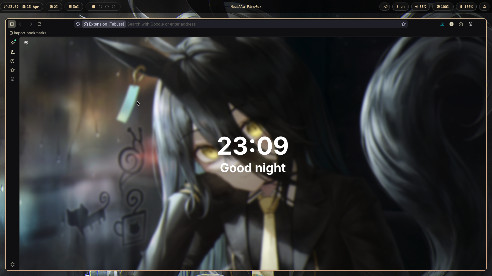
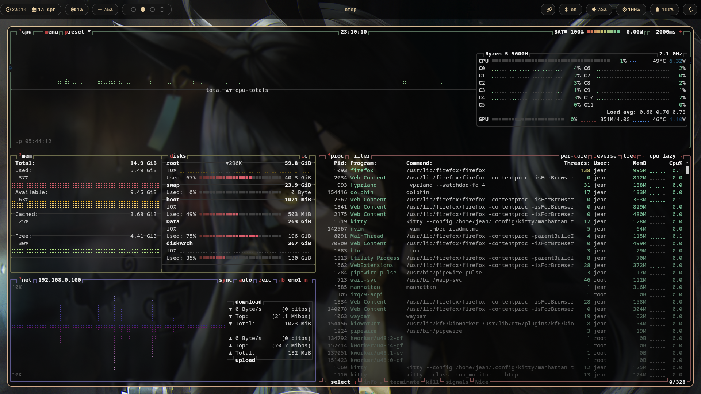
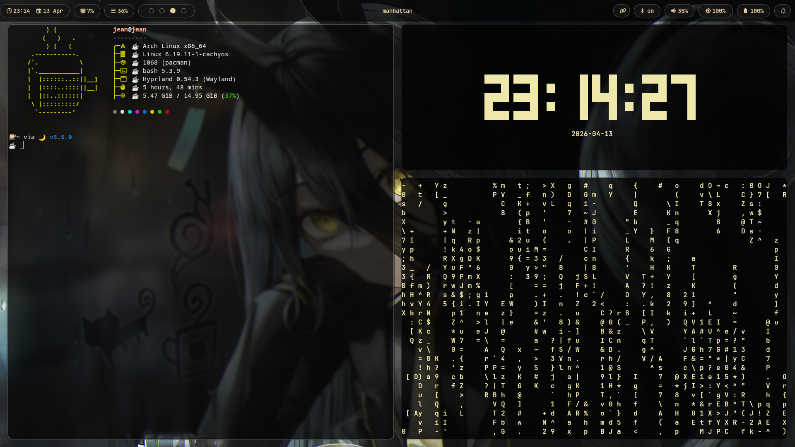
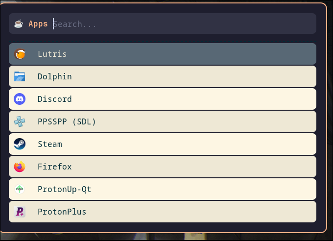
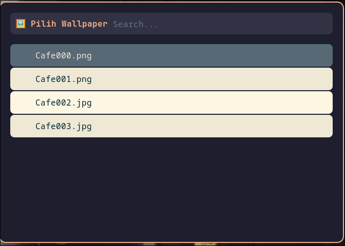
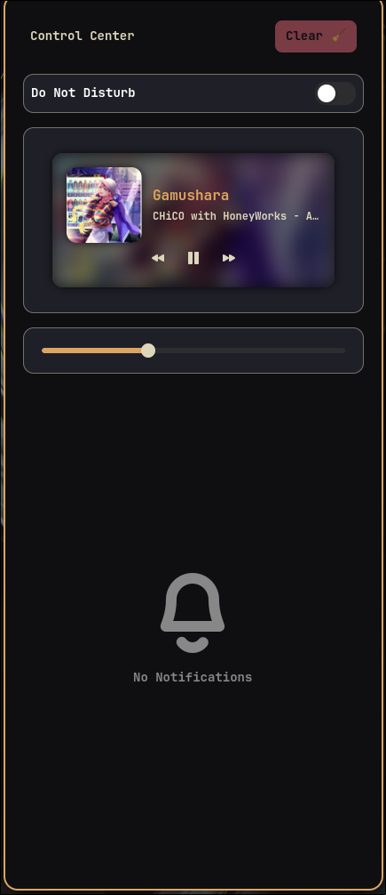

# 🌙 Jean's Arch + Hyprland Dotfiles
Welcome to my Arch Linux setup. It's nothing fancy—just a personalized environment built because I'm a fan of *Uma Musume*. I used to prefer Manhattan Cafe, but lately, I've been vibing more with Aston Machan.

## 📸 Preview




use SUPER + R to use the menu.

use Super + W to use the menu.



---

## 🛠️ The Specs
| Component | Software |
| :--- | :--- |
| **Distro** | Arch Linux (CachyOS Kernel) |
| **WM** | Hyprland |
| **Bar** | Waybar |
| **Terminal** | Kitty |
| **Shell** | Bash + Starship Prompt |
| **Launcher** | Rofi |
| **Notify** | Swaync / Dunst |
| **File Manager**| Yazi / Dolphin |
| **Editor** | Neovim / Code-OSS (0.85 Opacity) |

---

## ✨ Key Features
- **Pixel Perfect Workspace 3**: A dedicated productivity layout featuring a main Kitty terminal on the left, with a Clock Widget and Matrix background on the right.
- **Visual Aesthetics**: High-transparency Code-OSS (0.85 opacity) with active blur for a glassy, modern look.
- **Window Grouping**: Easily manage multiple windows by grouping them into tabs using `SUPER + G`.
- **Smart Screenshots**: 
  - `Print`: Select a specific area to copy directly to the clipboard.
  - `CTRL + Print`: Select a specific area to save it to ~/Pictures.
  - `SHIFT + Print`: Capture the full screen and save it to `~/Pictures`.
- **Wallpaper Picker**: Custom script mapped to `SUPER + W` to change the atmosphere instantly.
- **IME Support**: Fully configured `fcitx5` for multilingual input (Japanese/Kanji support).
- **Special Workspace**: Scratchpad via `SUPER + S` for hidden or temporary tasks.

---

## 🍱 Workspace Logic
- **WS 1**: 🌐 Web Browsing (Firefox auto-assigned).
- **WS 2**: 📊 System Monitoring (Btop auto-assigned).
- **WS 3**: 💻 Dev Environment (Kitty + Clock + Matrix layout).
- **WS 10**: 🛠️ General / Multimedia.

---

## 🚀 Installation (The Bare Repo Way)

I use a bare repository to manage these dotfiles without moving them from `~/.config`.

### 1. The Setup
Create an alias so the `config` command can access your bare repository:
```bash
alias config='/usr/bin/git --git-dir=$HOME/.dotfiles/ --work-tree=$HOME'

### 2. Clone the Repository
Clone the repository metadata into a hidden folder in your home directory:
git clone --bare [https://github.com/Aerhead09/Setup-dotfiles-arch.git](https://github.com/Aerhead09/Setup-dotfiles-arch.git) $HOME/.dotfiles

### 3. Checkout (Deploy Files)
Deploy the files to your Home directory. If you encounter errors because default files (like .bashrc) already exist, use this emergency backup script:

4. Housekeeping
Prevent Git from tracking every single file in your Home directory:
config config --local status.showUntrackedFiles no
